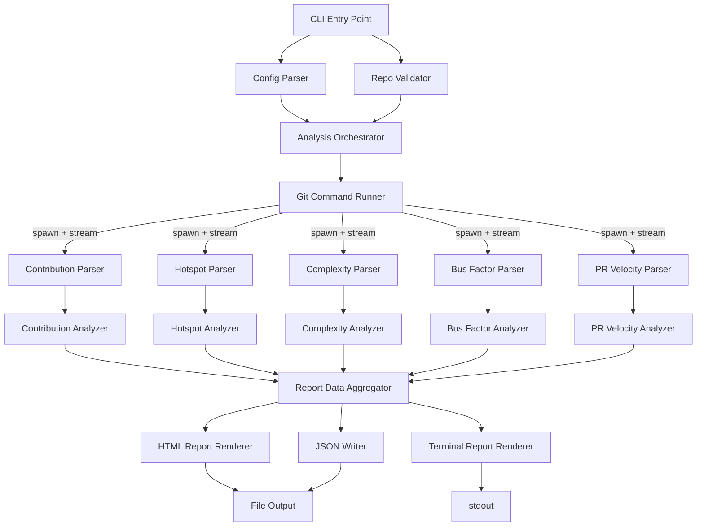

# Design Document: gitpeek

## Overview

gitpeek is a Node.js CLI tool that analyzes git repository history and produces visual reports. It runs via `npx gitpeek`, streams raw git command output through parsers, aggregates statistics across five analysis dimensions (contributions, hotspots, complexity trends, bus factor, PR velocity), and renders results as both a self-contained HTML report and a formatted terminal summary.

The system is designed around a streaming data pipeline: `child_process.spawn` executes git commands, stdout is piped through Node.js Transform streams into domain-specific parsers, and the parsed data feeds into analyzers that produce report-ready data structures. This architecture keeps memory usage low and enables analysis of repositories with hundreds of thousands of commits.

### Key Design Decisions

| Decision | Choice | Rationale |
|---|---|---|
| Git interface | `child_process.spawn` | Lighter and faster than nodegit/isomorphic-git; no native binaries to ship |
| Terminal UI | `ink` (React for CLI) | Excellent for complex layouts like sparklines, progress bars, and formatted tables |
| HTML charts | `ECharts` | Performant, highly customizable, easy to bundle inline without CDN dependencies |
| Data pipeline | Node.js Streams | Prevents V8 memory crashes on massive repos; enables backpressure |
| Language | TypeScript | Type safety for complex data structures; good DX with IDE support |

## Architecture



### Data Flow

1. **CLI Entry** — Parses flags, validates the target repo, resolves the git binary path.
2. **Orchestration** — Sequences analysis phases, manages progress reporting, applies `--since`/`--until`/`--branch`/`--scope` filters to all git commands.
3. **Git Execution** — Spawns git processes with appropriate arguments; streams stdout through pipes.
4. **Parsing** — Transform streams convert raw git output (log, shortlog, ls-tree, etc.) into structured records.
5. **Analysis** — Analyzers consume parsed records, compute aggregates (rankings, heatmaps, trends, bus factor scores).
6. **Aggregation** — Report Data Aggregator merges all analysis results into a single `ReportData` object, applying truncation limits for HTML (top 100 hotspots, top 50 contributors).
7. **Rendering** — HTML renderer injects data into a template with inlined ECharts JS + CSS. Terminal renderer uses ink to print formatted output with sparklines.

## Components and Interfaces

### Module Structure

```
src/
├── cli.ts                  # Entry point, argument parsing
├── config.ts               # Flag parsing and validation
├── validator.ts            # Repo and git binary validation
├── orchestrator.ts         # Analysis phase sequencing and progress
├── git/
│   ├── runner.ts           # Spawns git commands, returns readable streams
│   └── commands.ts         # Git command builders (log, shortlog, ls-tree, etc.)
├── parsers/
│   ├── log-parser.ts       # Parses git log output into commit records
│   ├── shortlog-parser.ts  # Parses git shortlog into author summaries
│   ├── numstat-parser.ts   # Parses --numstat output into file change records
│   ├── ls-tree-parser.ts   # Parses git ls-tree output into tree entries
│   └── merge-parser.ts     # Parses merge commits for PR velocity
├── analyzers/
│   ├── contributions.ts    # Contribution pattern analysis
│   ├── hotspots.ts         # Code hotspot detection
│   ├── complexity.ts       # Complexity trend computation
│   ├── bus-factor.ts       # Bus factor calculation
│   └── pr-velocity.ts      # PR velocity metrics
├── report/
│   ├── aggregator.ts       # Merges analyzer outputs, applies truncation
│   ├── html-renderer.ts    # Generates self-contained HTML report
│   ├── terminal-renderer.ts# Renders terminal output via ink
│   ├── json-writer.ts      # Writes raw JSON output
│   └── template/
│       └── report.html     # HTML template with ECharts placeholders
└── utils/
    ├── progress.ts         # Progress indicator and ETA calculation
    ├── time-decay.ts       # Time-decay weighting function
    └── sparkline.ts        # Unicode sparkline generation
```

### Key Interfaces

```typescript
// --- Config ---
interface GitPeekConfig {
  repoPath: string;
  branch?: string;
  since?: Date;
  until?: Date;
  scope?: string;
  followRenames: boolean;
  output: string;
  noOpen: boolean;
  noColor: boolean;
  json: boolean;
}

// --- Git Runner ---
interface GitRunner {
  /** Spawns a git command and returns a readable stream of stdout */
  stream(args: string[]): Readable;
  /** Spawns a git command and returns the full stdout as a string */
  exec(args: string[]): Promise<string>;
}

// --- Parsed Records ---
interface CommitRecord {
  hash: string;
  author: string;
  email: string;
  date: Date;
  message: string;
  isMerge: boolean;
  parentHashes: string[];
}

interface FileChangeRecord {
  commitHash: string;
  filePath: string;
  linesAdded: number;
  linesRemoved: number;
  author: string;
  date: Date;
}

interface TreeEntry {
  mode: string;
  type: 'blob' | 'tree';
  hash: string;
  path: string;
  size: number;
}

// --- Analyzer Outputs ---
interface ContributionData {
  authors: AuthorSummary[];
  heatmap: number[][];          // [dayOfWeek][hourOfDay] -> commit count
  totalCommits: number;
}

interface AuthorSummary {
  name: string;
  email: string;
  commits: number;
  linesAdded: number;
  linesRemoved: number;
}

interface HotspotData {
  hotspots: FileHotspot[];
}

interface FileHotspot {
  filePath: string;
  changeCount: number;
  uniqueAuthors: number;
}

interface ComplexityTrendData {
  snapshots: ComplexitySnapshot[];
  interval: 'weekly' | 'monthly';
}

interface ComplexitySnapshot {
  date: Date;
  totalFiles: number;
  totalSize: number;           // sum of file sizes as proxy for complexity
  churnRate: number;           // files changed / total files in period
}

interface BusFactorData {
  overall: BusFactorResult;
  perDirectory: Map<string, BusFactorResult>;
  singlePointRisks: string[];  // file paths with only 1 recent author
}

interface BusFactorResult {
  scope: string;
  busFactor: number;
  topAuthors: { name: string; weightedCommits: number }[];
}

interface PRVelocityData {
  available: boolean;
  averageMergeTime: number | null;   // milliseconds
  mergesPerMonth: { month: string; count: number }[];
  totalMerges: number;
  warningMessage?: string;
}

// --- Aggregated Report ---
interface ReportData {
  repoName: string;
  analyzedBranch: string;
  dateRange: { from: Date; to: Date };
  contributions: ContributionData;
  hotspots: HotspotData;
  complexity: ComplexityTrendData;
  busFactor: BusFactorData;
  prVelocity: PRVelocityData;
  generatedAt: Date;
}
```

### Component Responsibilities

**GitRunner** (`git/runner.ts`)
- Wraps `child_process.spawn` with consistent error handling
- Applies global filters (`--since`, `--until`, `--branch`, `--scope`) to all commands
- Returns `Readable` streams for pipeline consumption
- Handles git process exit codes and stderr
- Ensures `.mailmap` resolution is active by using `%aN` and `%aE` format specifiers (mailmap-resolved author name/email) in all `git log` format strings instead of `%an`/`%ae`

**Parsers** (`parsers/`)
- Each parser is a `Transform` stream that converts raw git output lines into typed records
- Parsers are stateless and reusable
- Line-based parsing with `\n` delimiter; handles partial chunks via internal buffering

**Analyzers** (`analyzers/`)
- Consume arrays of parsed records (collected from streams)
- Pure functions where possible: `(records, config) => AnalysisResult`
- Bus factor analyzer uses the time-decay utility for weighting; author identity is resolved via git's native `.mailmap` support (using `%aN`/`%aE` format specifiers), so authors who changed their name or email during the analysis period are correctly unified
- Hotspot analyzer uses a two-phase approach: (1) a single `git log --name-status` pass to compute change frequencies for all files, then (2) only when `--follow-renames` is enabled, runs `git log --follow` for the final top-20 hotspot files in parallel using `p-limit` with concurrency of 5
- PR velocity analyzer avoids per-merge `git merge-base` calls. Instead, it builds a main-line commit set from a single `git log --first-parent` pass, then for each merge commit's second parent, walks back to find where it diverges from main-line. This approximates branch creation time in a single cached pass

**Orchestrator** (`orchestrator.ts`)
- Runs analysis phases sequentially (contributions → hotspots → complexity → bus factor → PR velocity)
- Reports progress after each phase completes
- Passes config filters to GitRunner for each phase

**HTML Renderer** (`report/html-renderer.ts`)
- Reads the HTML template, injects serialized `ReportData` as a `<script>` tag
- Inlines the ECharts library JS directly into the HTML
- Inlines all CSS
- Applies truncation: top 100 hotspots, top 50 contributors for HTML

**Terminal Renderer** (`report/terminal-renderer.ts`)
- Uses `ink` to render a React component tree to stdout
- Renders sparklines using Unicode block characters (▁▂▃▄▅▆▇█)
- Respects `--no-color` flag by disabling ANSI codes
- Uses Unicode box-drawing characters for table borders

## Data Models

### Git Command Mapping

| Analysis Phase | Git Command | Output Format |
|---|---|---|
| Contributions | `git log --format="%H|%aN|%aE|%aI|%s|%P"` | Pipe-delimited commit records (mailmap-resolved) |
| Contributions (stats) | `git log --numstat --format="%H|%aN|%aI"` | Numstat with commit headers (mailmap-resolved) |
| Hotspots | `git log --name-status --format="%H"` | Commit hash + changed file paths (single pass for all files) |
| Hotspots (renames) | `git log --follow --name-only -- <file>` | Per-file follow for top-20 hotspots only (parallelized via `p-limit`, concurrency 5) |
| Complexity | `git ls-tree -r -l <tree-ish>` | Tree entries with file sizes |
| Complexity (snapshots) | `git rev-list --after=<date> --before=<date> -1 <branch>` | Commit hash at snapshot point |
| Bus Factor | Reuses contribution + hotspot data | N/A (derived) |
| PR Velocity | `git log --merges --format="%H|%aI|%P|%s"` | Merge commit records |
| PR Velocity (main-line) | `git log --first-parent --format="%H"` | Main-line commit hashes (cached, single pass) |
| PR Velocity (branch divergence) | Walk second parent of each merge back to main-line | Approximates branch creation time without per-merge `merge-base` calls |

### Time-Decay Weighting Model

The bus factor calculation uses a linear time-decay function:

```
weight(commit) =
  if age <= 12 months: 1.0
  if age > 36 months: 0.1
  else: 1.0 - 0.9 * (age - 12) / 24
```

Where `age` is the number of months between the commit date and the reference date. The reference date is the `--until` date when provided, otherwise the current system time. This ensures that when a user runs `gitpeek --until 2022-01-01`, the bus factor reflects the project's health at that specific point in time rather than relative to today.

### Complexity Snapshot Sampling

- Repositories with ≥ 3 months of history: sample monthly (first commit of each month)
- Repositories with < 3 months of history: sample weekly
- For each sample point, use `git rev-list` to find the commit at that date, then `git ls-tree -r -l` to read the tree without checkout
- Complexity proxy = total file size across all tracked files + churn rate (files changed in period / total files)

### Report Data Truncation

| Context | Hotspots Limit | Contributors Limit |
|---|---|---|
| HTML Report | 100 | 50 |
| Terminal Report | 20 | 10 |
| JSON Output | Unlimited | Unlimited |

### HTML Report Structure

The HTML report is a single `.html` file containing:
1. Inlined CSS for layout and styling
2. Inlined ECharts library (~800KB minified)
3. A `<script>` block containing the serialized `ReportData` as JSON
4. Chart initialization code that reads the embedded data and renders:
   - Bar chart: top contributors by commits
   - Heatmap: commit activity by day/hour
   - Horizontal bar chart: top code hotspots by change frequency
   - Line chart: complexity trend over time
   - Gauge/number: overall bus factor + per-directory breakdown table
   - Line chart: merges per month (PR velocity)
5. No external dependencies — fully offline-capable


## Correctness Properties

*A property is a characteristic or behavior that should hold true across all valid executions of a system — essentially, a formal statement about what the system should do. Properties serve as the bridge between human-readable specifications and machine-verifiable correctness guarantees.*

### Property 1: Repository validation correctness

*For any* directory path, the repository validator should return success if and only if the directory contains a valid `.git` folder. Non-git directories must produce an error with a non-zero exit code.

**Validates: Requirements 1.1, 1.3**

### Property 2: Contribution aggregation invariant

*For any* set of commit records with associated file changes, the sum of per-author commit counts should equal the total commit count, and the sum of per-author lines added/removed should equal the global totals.

**Validates: Requirements 2.1**

### Property 3: Heatmap completeness invariant

*For any* set of commit records, the sum of all cells in the day-of-week × hour-of-day heatmap should equal the total number of commits, and each commit should map to exactly one cell.

**Validates: Requirements 2.2**

### Property 4: Contributor ranking correctness

*For any* set of author summaries, the top-N contributors list should be sorted in strictly non-increasing order by commit count, and its length should be `min(N, totalAuthors)`.

**Validates: Requirements 2.3, 2.4**

### Property 5: File change frequency correctness

*For any* set of file change records, the computed change frequency for each file should equal the number of distinct commit hashes that modified that file.

**Validates: Requirements 3.1**

### Property 6: Hotspot ranking correctness

*For any* set of file hotspots, the top-20 list should be sorted in strictly non-increasing order by change count, and its length should be `min(20, totalFiles)`.

**Validates: Requirements 3.2**

### Property 7: Complexity snapshot interval correctness

*For any* repository date range of ≥ 3 months, complexity snapshots should be spaced approximately one month apart. *For any* date range of < 3 months, snapshots should be spaced approximately one week apart. In both cases, the first snapshot should be near the start of the range and the last near the end.

**Validates: Requirements 4.1, 4.3**

### Property 8: Complexity metric computation invariant

*For any* set of tree entries at a snapshot point, the `totalSize` should equal the sum of individual file sizes, and `totalFiles` should equal the count of blob entries. The `churnRate` should equal files changed in the period divided by total files.

**Validates: Requirements 4.2**

### Property 9: Read-only analysis safety

*For any* analysis run, the git commands issued should never include operations that modify the working tree, index, or HEAD (no `checkout`, `reset`, `merge`, `rebase`, `commit`, `stash`, or `clean` commands).

**Validates: Requirements 4.5, 4.6**

### Property 10: Bus factor threshold correctness

*For any* set of authors with weighted commit counts and any scope, the computed bus factor N should satisfy: the top N authors by weighted commits collectively account for ≥ 50% of total weighted commits, and the top N-1 authors account for < 50%.

**Validates: Requirements 5.1, 5.2, 5.3**

### Property 11: Time-decay weighting correctness

*For any* commit age in months, the weight function should return: 1.0 if age ≤ 12, 0.1 if age > 36, and a linearly interpolated value between 1.0 and 0.1 for ages in (12, 36]. The weight should always be in the range [0.1, 1.0].

**Validates: Requirements 5.4**

### Property 12: Single-point-of-knowledge detection

*For any* file and its set of authors within the last 12 months, the file should appear in the single-point-of-knowledge risk list if and only if it has exactly one distinct author in that period.

**Validates: Requirements 5.5**

### Property 13: Merge time computation correctness

*For any* set of merge records with associated branch creation timestamps, the computed average merge time should equal the arithmetic mean of individual (merge date − branch creation date) durations.

**Validates: Requirements 6.2**

### Property 14: Merges-per-month completeness

*For any* set of merge commits, the sum of all merges-per-month counts should equal the total number of merge commits.

**Validates: Requirements 6.3**

### Property 15: HTML report self-containment

*For any* generated HTML report, the file should contain zero external resource references — no `<link href="...">` to external stylesheets, no `<script src="...">` to external scripts, and no `` tags.

**Validates: Requirements 7.1**

### Property 16: Report data truncation and JSON completeness

*For any* ReportData where hotspots exceed 100 or contributors exceed 50, the HTML-bound data should contain at most 100 hotspots and 50 contributors. Conversely, *for any* ReportData, the JSON output should contain the full untruncated dataset with counts matching the original.

**Validates: Requirements 7.7, 7.8**

### Property 17: No-color output correctness

*For any* terminal report rendered with `noColor=true`, the output string should contain zero ANSI escape sequences (no `\x1b[` patterns).

**Validates: Requirements 8.3**

### Property 18: Date range filtering correctness

*For any* set of commits and a date range [since, until], all commits included in the analysis should have dates ≥ since (when specified) and ≤ until (when specified). No commits outside the range should be included.

**Validates: Requirements 10.1, 10.2**

### Property 19: Scope path filtering correctness

*For any* scope path and set of file records, only files whose paths are prefixed by the scope path should be included in analysis results. Files outside the scope should be excluded from all analysis dimensions.

**Validates: Requirements 10.7**

### Property 20: Invalid scope rejection

*For any* scope path that does not exist within the repository's tracked files, the CLI should exit with a descriptive error and non-zero exit code.

**Validates: Requirements 10.8**

## Error Handling

### Error Categories

| Category | Trigger | Behavior |
|---|---|---|
| No git binary | `git` not found on PATH | Exit with code 1, message: "git is not installed. Install it from https://git-scm.com" |
| Invalid repository | Target path has no `.git` | Exit with code 1, message: "Not a git repository: {path}" |
| Invalid scope | `--scope` path not in repo | Exit with code 1, message: "Scope path not found in repository: {path}" |
| Unrecognized flag | Unknown CLI argument | Print help text, exit with code 1 |
| Git command failure | Non-zero exit from git process | Log stderr, skip the failed analysis phase, continue with remaining phases |
| Empty repository | No commits in history | Exit with code 1, message: "Repository has no commits" |
| No merge commits | Linear history detected | Set `prVelocity.available = false`, include warning message in report, continue |
| Parse error | Malformed git output line | Log warning, skip the malformed record, continue parsing |
| File write error | Cannot write report to disk | Exit with code 1, message: "Cannot write report: {error}" |

### Error Handling Strategy

- **Fail fast** for environment errors (no git, invalid repo, invalid scope, unrecognized flags)
- **Graceful degradation** for analysis errors: if one phase fails, skip it and continue with the rest. The report will omit the failed section.
- **Stream error propagation**: Transform stream errors are caught and logged; the stream is ended gracefully to avoid hanging processes.
- **Git process cleanup**: If a spawned git process is still running when an error occurs, send SIGTERM and wait for exit.

## Testing Strategy

### Dual Testing Approach

gitpeek uses both unit tests and property-based tests for comprehensive coverage.

**Unit Tests** (using Vitest):
- Specific examples: known git log output → expected parsed records
- Integration points: orchestrator correctly sequences phases
- Edge cases: empty repos, repos with no merges, single-author repos, repos with < 3 months history
- Error conditions: missing git binary, invalid paths, malformed git output
- CLI flag parsing: each flag produces the correct config
- HTML output: contains expected chart initialization sections

**Property-Based Tests** (using fast-check with Vitest):
- Each correctness property from the design maps to exactly one property-based test
- Minimum 100 iterations per property test
- Each test is tagged with a comment: `// Feature: gitpeek, Property {N}: {title}`
- Generators produce random but valid instances of: commit records, file change records, author summaries, tree entries, merge records, date ranges, directory paths

### Test Organization

```
tests/
├── unit/
│   ├── config.test.ts
│   ├── validator.test.ts
│   ├── parsers/
│   │   ├── log-parser.test.ts
│   │   ├── numstat-parser.test.ts
│   │   ├── ls-tree-parser.test.ts
│   │   └── merge-parser.test.ts
│   ├── analyzers/
│   │   ├── contributions.test.ts
│   │   ├── hotspots.test.ts
│   │   ├── complexity.test.ts
│   │   ├── bus-factor.test.ts
│   │   └── pr-velocity.test.ts
│   ├── report/
│   │   ├── html-renderer.test.ts
│   │   ├── terminal-renderer.test.ts
│   │   └── aggregator.test.ts
│   └── utils/
│       ├── time-decay.test.ts
│       └── sparkline.test.ts
└── properties/
    ├── repo-validation.prop.test.ts        # Property 1
    ├── contribution-aggregation.prop.test.ts # Property 2
    ├── heatmap-completeness.prop.test.ts    # Property 3
    ├── contributor-ranking.prop.test.ts     # Property 4
    ├── change-frequency.prop.test.ts        # Property 5
    ├── hotspot-ranking.prop.test.ts         # Property 6
    ├── snapshot-interval.prop.test.ts       # Property 7
    ├── complexity-metric.prop.test.ts       # Property 8
    ├── readonly-safety.prop.test.ts         # Property 9
    ├── bus-factor-threshold.prop.test.ts    # Property 10
    ├── time-decay.prop.test.ts             # Property 11
    ├── single-point-risk.prop.test.ts      # Property 12
    ├── merge-time.prop.test.ts             # Property 13
    ├── merges-per-month.prop.test.ts       # Property 14
    ├── html-self-contained.prop.test.ts    # Property 15
    ├── truncation-completeness.prop.test.ts # Property 16
    ├── no-color.prop.test.ts               # Property 17
    ├── date-range-filter.prop.test.ts      # Property 18
    ├── scope-filter.prop.test.ts           # Property 19
    └── invalid-scope.prop.test.ts          # Property 20
```

### Property Test Tagging Convention

Each property test file must include a tag comment at the top:

```typescript
// Feature: gitpeek, Property 1: Repository validation correctness
```

### Testing Libraries

- **Test runner**: Vitest (fast, TypeScript-native, compatible with Node.js streams)
- **Property-based testing**: fast-check (mature, well-maintained, excellent TypeScript support, rich built-in arbitraries)
- **Minimum iterations**: 100 per property test (`fc.assert(property, { numRuns: 100 })`)
